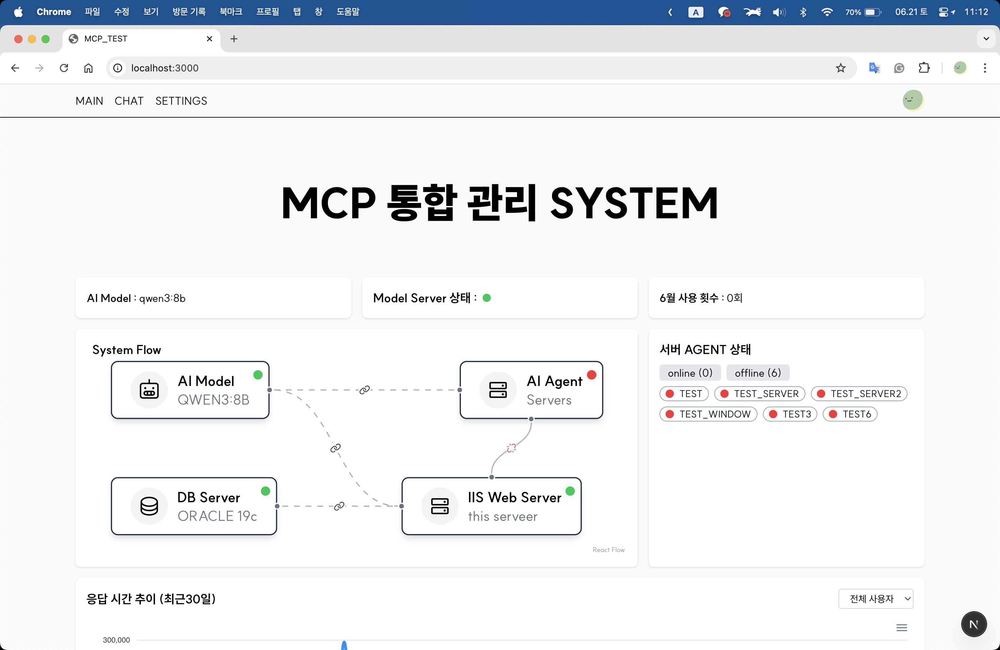

# MCP_NEXT-NODE

이 프로젝트는 Next.js 기반의 웹 클라이언트와 Socket.IO 서버, Oracle 데이터베이스 그리고 Qwen3 모델 서버를 이용해 MCP(Machine Context Protocol) 에이전트를 관리하는 시스템입니다.



## 구성 요소

- **WebServer (Next.js)** – React 19와 TypeScript로 작성된 프론트엔드입니다. Google OAuth를 이용한 로그인(`next-auth`)과 여러 API 라우트가 포함되어 있습니다.
- **Model Server (Qwen3)** – Ollama를 통해 `qwen3:8b` 모델을 호출합니다. 모델 주소는 `MODEL_PORT` 환경 변수로 지정합니다.
- **DB Server (Oracle)** – `oracledb` 모듈을 사용하여 메시지, 서버 정보, MCP 설정을 저장합니다. 데이터베이스 접속 정보는 환경 변수로 관리됩니다.
- **Python Client** – Socket.IO를 통해 통신하는 MCP 에이전트로 [lee7198/MCP_AGENT](https://github.com/lee7198/MCP_AGENT) 저장소에서 확인할 수 있습니다.

## 디렉터리 구조

```
app/                Next.js 애플리케이션 소스
  ├─ api/            API 라우트
  ├─ lib/            데이터베이스 로직 등 공통 모듈
  ├─ hooks/          커스텀 훅 (예: `useSocket`)
  ├─ services/       클라이언트용 API 래퍼
  ├─ store/          zustand 상태 관리
  └─ (main)/         주요 페이지와 컴포넌트
socket/server.ts    Express + Socket.IO 서버 (포트 3001)
```

## 환경 변수

`app/lib/db/connection.ts`에서 확인할 수 있듯 다음 변수가 필요합니다.

```
ORACLE_USER
ORACLE_PASSWORD
ORACLE_CONNECT_STRING
```

또한 모델 서버 연결을 위해 `MODEL_PORT`가 사용됩니다(`app/api/model/ai-request/route.ts` 참고). Google OAuth와 `next-auth`를 위해 다음 값도 필요합니다.

```
GOOGLE_CLIENT_ID
GOOGLE_CLIENT_SECRET
NEXTAUTH_SECRET
```

`.env.local` 파일에 위 변수를 설정하면 됩니다.

## 사용 방법

1. 의존성 설치:
   ```bash
   npm install
   ```
2. 개발 서버 실행:
   ```bash
   npm run dev
   ```
   `package.json`의 스크립트에 따라 Socket.IO 서버와 Next.js 개발 서버가 함께 실행됩니다.
3. 브라우저에서 <http://localhost:3000> 에 접속하면 웹 클라이언트를 확인할 수 있습니다.

테스트는 Jest로 작성되어 있으며 `npm test` 로 실행할 수 있습니다.

## 소켓 통신

`socket/server.ts`에서 Socket.IO 서버가 포트 3001에서 동작하며 웹 클라이언트와 Python MCP 에이전트 사이의 메시지를 중계합니다. 클라이언트 목록은 `/api/clients` 엔드포인트로 제공됩니다.

## 참고

- Qwen3 모델 서버는 Ollama를 통해 구동되어야 하며, `MODEL_PORT`에 해당 포트를 지정합니다.
- Python MCP 에이전트 실행 방법은 [MCP_AGENT](https://github.com/lee7198/MCP_AGENT) 저장소를 참고하세요.
